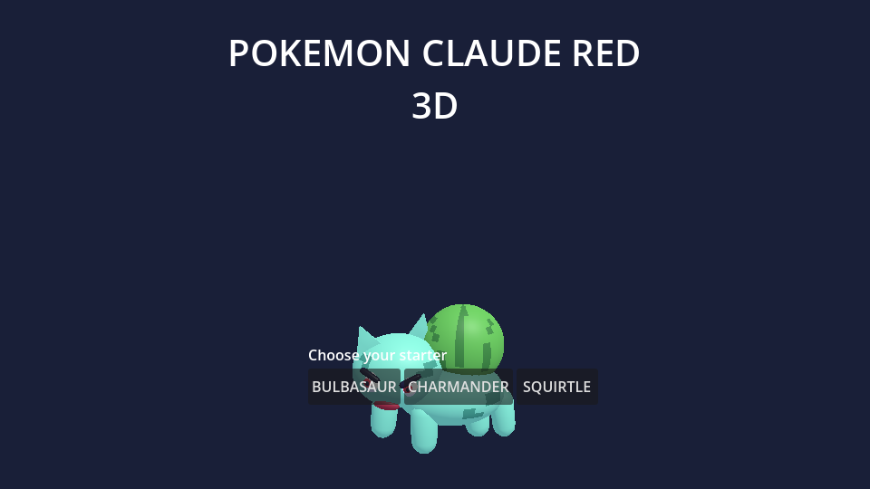
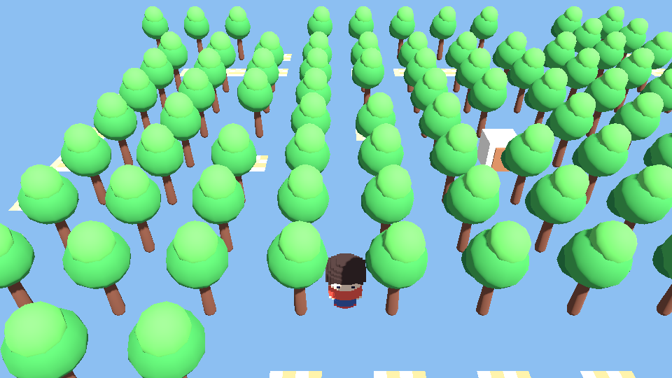
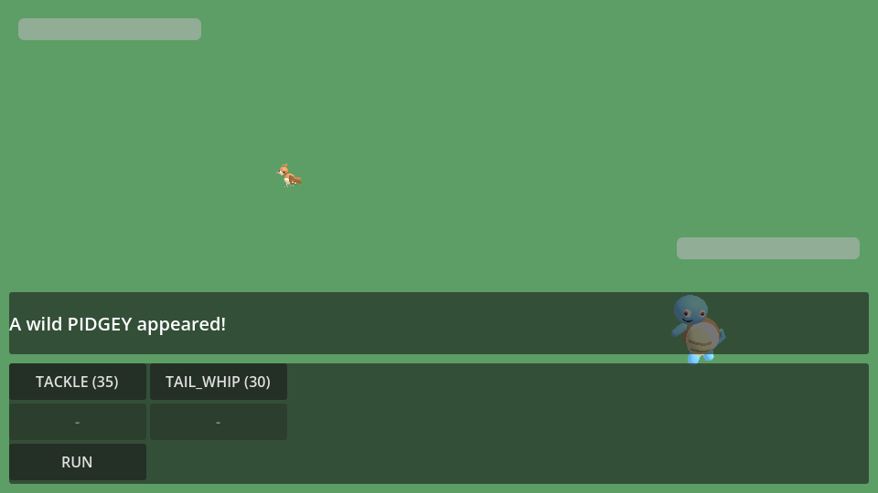
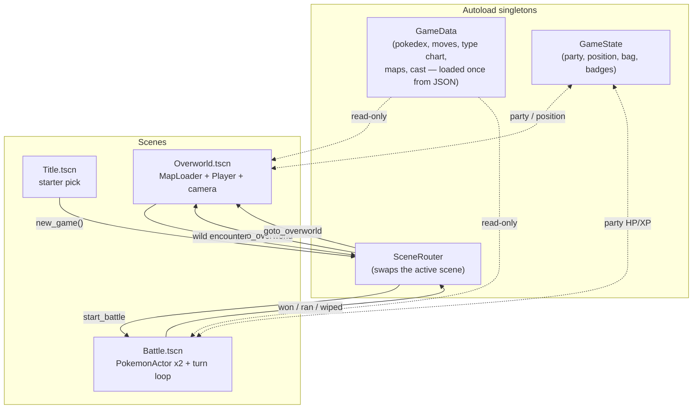
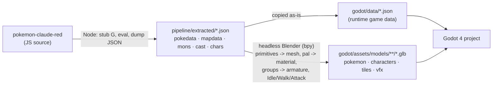
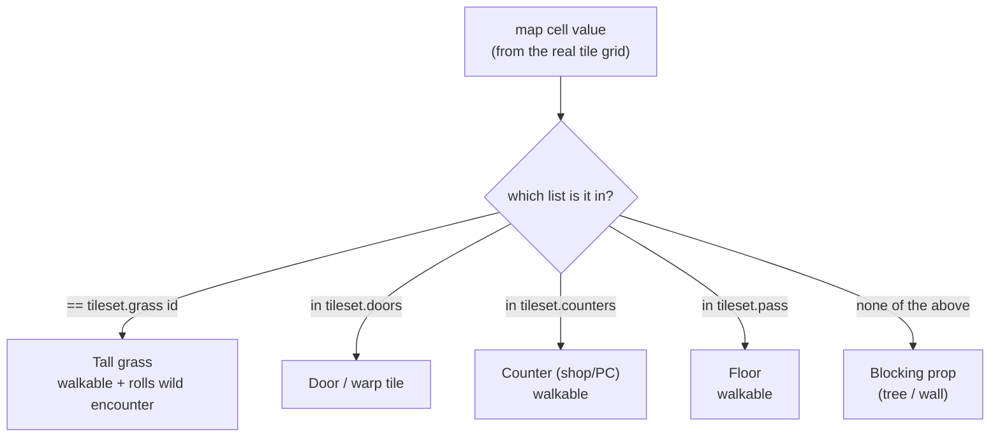
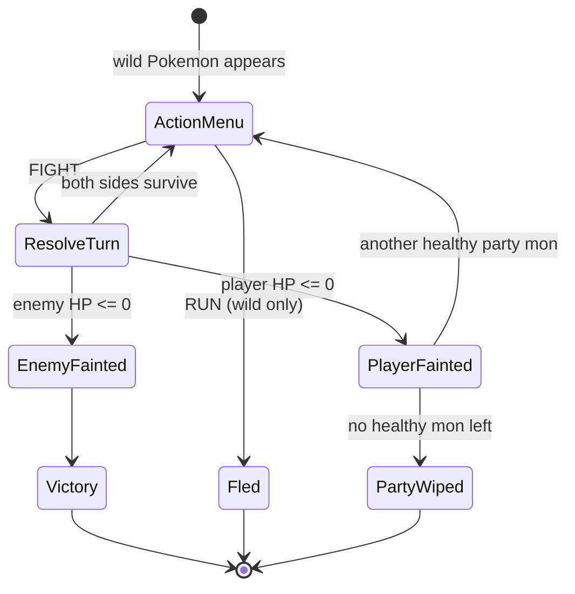

# redgodot

A Godot 4 / 3D reimagining of **[Pokémon Claude Red](https://github.com/levy-street/pokemon-claude-red)**
— a from-scratch, zero-image-files Pokémon Red remake originally built entirely
out of procedural 2D pixel art. This project ports its real game data (all 151
species, all 165 moves, the full type chart, all 223 Kanto maps, the full cast)
into a real Godot 4 project, and turns its 2D vector art definitions into actual
3D models, materials and animations using **headless Blender** — no manual
modelling, no downloaded assets, no original game images anywhere in this repo.

Fan project, unofficial, not affiliated with Nintendo / Game Freak / Creatures
Inc., built for educational purposes on top of the openly-published
[pokemon-claude-red](https://github.com/levy-street/pokemon-claude-red) source.
Code in this repository is MIT licensed (see `LICENSE`); no original game
assets from Nintendo's Pokémon Red are included or redistributed.

**Tooling:** [Godot 4.7.2](https://godotengine.org/download) (headless,
`--headless --rendering-driver opengl3`) and **Blender 5.0.1** (headless, via
the official [`bpy` PyPI package](https://pypi.org/project/bpy/) — no GUI
ever). Both are the newest versions actually reachable from the sandbox this
was built in, which blocks `blender.org` at the network-policy level; see
`pipeline/README.md` for the exact story and how to run the same scripts
against a newer standalone Blender if yours can reach it.

## What this actually is (read this before the screenshots)

Converting a ~27k-line, 151-species, 223-map game to bespoke, hand-authored 3D
art is a multi-month project. This is a **real, working vertical slice** with a
**complete data foundation**, not a mockup:

| Layer | Status |
|---|---|
| Game data (species, moves, type chart, maps, cast) | **Complete** — 151/151 species, 165/165 moves, 223/223 maps, ported verbatim from the source's real data tables |
| 3D models (headless Blender 5.0.1 pipeline) | **151/151 Pokemon species generated, 0 fallbacks** (real per-species geometry, materials, and Idle/Walk/Attack animations built from each species' actual vector-art data + Pokedex height) + a rigged/tintable humanoid character base + a 14-piece overworld tile kit + 9 battle VFX meshes — see `godot/assets/models/*/manifest.json` for exact per-asset detail |
| Overworld (3D, tile-accurate movement/collision/warps/encounters) | **Working** for all 223 maps via a generic tile classifier (pass/grass/door/counter lists from the real tileset data) |
| Battle system | **Working** for wild encounters (FIGHT/RUN), using the original Gen-1 damage formula ported line-for-line into `BattleMath.gd` |
| Trainer battles, catching, full menu suite (bag/PC/save), overworld dialogue/story scripts | **Not implemented** — data is present and wired for it (trainer parties, items, dialogue text all extracted), but the interaction layer is future work |

If a Pokémon or map looks simple, it's using the honest fallback path
(a colored primitive) rather than pretending — every part of the pipeline
either uses the real per-species/per-map data or visibly falls back, there's no
placeholder pretending to be final art.

## Screenshots

*(Captured headlessly via `xvfb-run godot4 --rendering-driver opengl3`, the same
command the CI workflow runs — these are real, in-engine screenshots of the
actual Blender-generated models, not mockups.)*

| Title (real generated Bulbasaur) | Overworld (Pallet Town, real tile data) | Battle (real Squirtle vs. Pidgey) |
|---|---|---|
|  |  |  |

## Architecture



## Data & asset pipeline



See `pipeline/README.md` for the exact commands and the primitive-to-mesh
mapping (ellipsoid → sphere, tapered capsule → capsule mesh, flat polygon →
extruded fin, etc).

## Overworld tile classification

The original game's 223 maps are tile-grid data (`pass`/`grass`/`doors`/`counters`
id lists per tileset — the same lists the original engine used for collision).
Rather than requiring bespoke art per tile id per tileset, every map is built
from one shared, Blender-generated tile kit classified generically:



## Battle flow



`BattleMath.gd` ports the original's `calcDamage` step-for-step: the same
`floor(floor(floor(2L/5+2)*power*atk/def)/50)` core, the same STAB (`x1.5`),
the same type-chart lookup, the same crit rule (`floor(spd/2)/256`, doubling
level on a hit), and the same `217..255/255` final random factor.

## Running it

Requires the [Godot 4.7+ engine](https://godotengine.org/download) (this repo
targets Godot 4.7.2).

```sh
godot4 --path godot --import   # first run only: import assets
godot4 --path godot            # play
```

Controls: arrow keys / WASD to move, Space/Enter to confirm, Escape/X to
cancel, Enter to open the party menu.

### Running tests

```sh
godot4 --headless --path godot --import
godot4 --headless --path godot -- --run-tests
```

26 assertions cover the ported damage formula (including a same-seed crit vs.
non-crit comparison), the type chart, data loading (151 species / 223 maps),
map tile classification, and the wild-encounter slot table — see
`godot/scripts/util/TestSuite.gd`.

### Taking your own screenshots

```sh
xvfb-run godot4 --path godot --rendering-driver opengl3 \
  -- --screenshot=/tmp/out.png --scene=overworld --wait=1.5
# --scene is one of: title, overworld, battle
```

## Regenerating the 3D assets

See `pipeline/README.md`. In short: `node pipeline/scripts/extract_*.js`, then
`blender --background --python pipeline/blender/gen_*.py`. Both are fully
deterministic and re-runnable against a fresh clone of the source repo.

## Roadmap / not yet implemented

- Trainer battles (multi-mon parties, switching) — data is extracted and ready
  (`pokedata.json` `trainerClasses`/`parties`), turn-loop support is the
  remaining work.
- Catching, the Bag, the PC, saving/loading.
- Overworld dialogue and the story scripts (`src/game/story.js` /
  `src/scripts/*.js` in the source) — text data is extracted but not wired to
  NPC interaction yet.
- Per-character mesh variety (hats, dresses, hairstyles) beyond the single
  base humanoid + material-tint approach documented in
  `godot/assets/models/characters/manifest.json`.
- Distinguishing tree/wall/water visually per tile id (currently one generic
  "blocking" prop for anything outside a tileset's `pass` list).
